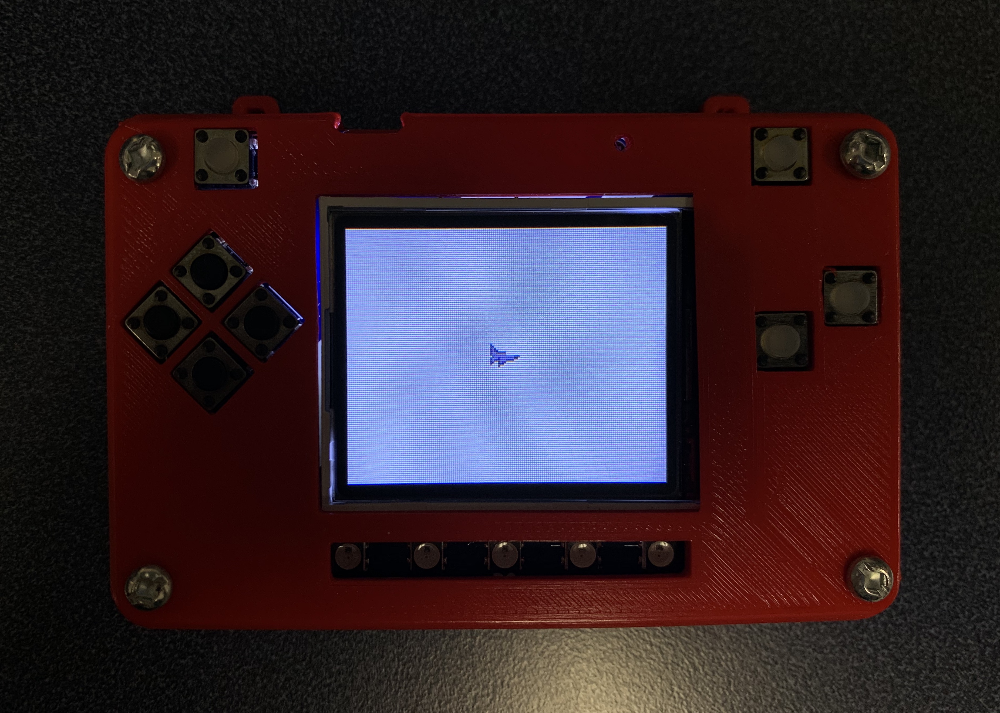

.. _space_ship:

Show Airplane
==========

sprites can be placed in front of the background. Create a list called sprites and put the ninth image in the image bank.

.. code-block:: python
        :linenos:

        sprites = []

        plane = stage.Sprite(image_bank_1, 8, 72, 56)
        sprites.append(plane)

As soon as you save the file onto the PyBadge, the screen should flash and you should see something like:

   Plane on PyBadg

This code will not work. There is a lot more to this code. Below is the full version of the code above. I imported stage and ugame. Also I add the list of sprites in layers and in the game rendering of while loop function.

.. code-block:: python
      :linenos:

      #!/usr/bin/env python3

      # Created by : Jay Lee
      # Created on : Jan 2020
      # This program display sprite

      import ugame
      import stage

      def main():
          # this function display background of pybadge
          image_bank_1 = stage.Bank.from_bmp16("avoid_or_shoot.bmp")

          background = stage.Grid(image_bank_1, 10, 8)

          sprites = []

          plane = stage.Sprite(image_bank_1, 8, 72, 56)
          sprites.append(plane)

          # create a stage for the background to show up on
          #   and set the frame rate to 60fps
          game = stage.Stage(ugame.display, 60)
          # set the layers, items show up in order
          game.layers = sprites + [background]
          # render the background and inital location of sprite list
          # most likely you will only render background once per scene
          game.render_block()

          # repeat forever, game loop
          while True:
              game.render_sprites(sprites)
              game.tick()

      if __name__ == "__main__":
          main()

Now, you can get a sprite to show up in front of your background on your PyBadge.  
