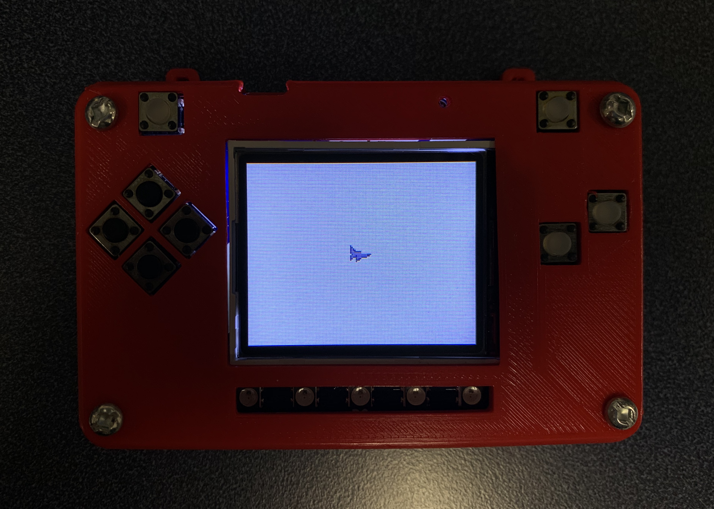
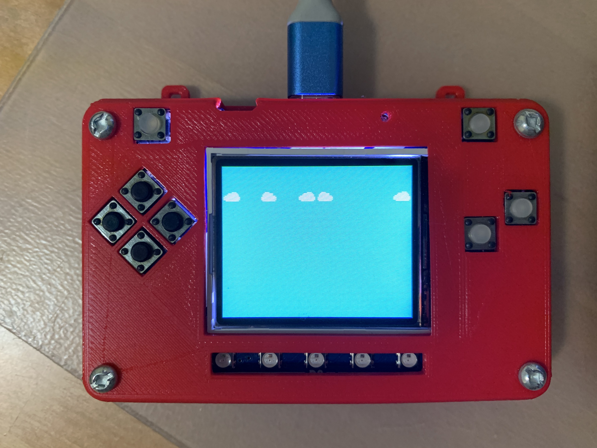

.. _background:

Background
==========

Avoid or Shoot needs a background. This code is puts the first image in the background. The first image is 16 x 16 px image at the top. in this case the first image of image bank is white colour image. Of course when you save the file, save it as :file:`code.py` file:

.. code-block:: python
	:linenos:

	image_bank_1 = stage.Bank.from_bmp16("avoid_or_shoot.bmp")

   	background = stage.Grid(image_bank_1, 10, 8)

As soon as you save the file onto the PyBadge, the screen should flash and you should see something like:

   Plane on PyBadg

This code will not work. The code above has a lot to do. Here is a better version that shows the background. You can see that you called the :py:func:`main()` function. This is common in python code but usually not visible in CircuitPython. I am including it because by breaking the code into different functions to match different scenes, eventually will be really helpful.

.. code-block:: python
	:linenos:
	
	for y_location in range(8):
            for x_location in range(16):
                if y_location == 1:
                    tile_picked = random.randint(1, 3)
                else:
                    tile_picked = random.randint(1, 1)
                background.tile(x_location, y_location, tile_picked)

As soon as you save the file onto the PyBadge, the screen should flash and you should see something like:

   Game Background on PyBadge

This codes replace the background of pybadge with another 16x16 image. pybadge contains 16 images on the x-axis and 8 image on the y-axis in the image bank. It fills that background with a for loop. When the second image is filled on the y-axis, it randomly fills the second to fourth images in the image bank.

.. code-block:: python
	:linenos:

	#!/usr/bin/env python3

	# Created by : Jay Lee
	# Created on : Jan 2020
	# This program display background of pybadge
	
	import ugame
	import stage
	import random

	  
	def main():
	    # this function display background of pybadge
	    image_bank_1 = stage.Bank.from_bmp16("avoid_or_shoot.bmp")
   	    background = stage.Grid(image_bank_1, 10, 8)
	    
	    for y_location in range(8):
                for x_location in range(16):
                    if y_location == 1:
                        tile_picked = random.randint(1, 3)
                    else:
                        tile_picked = random.randint(1, 1)
                    background.tile(x_location, y_location, tile_picked)

	    game = stage.Stage(ugame.display, 60)
	    game.layers = [background]
	    game.render_block()

	    while True:
	    	pass

	if __name__ == "__main__":
	    main()
    

This is the basis of the background function.
