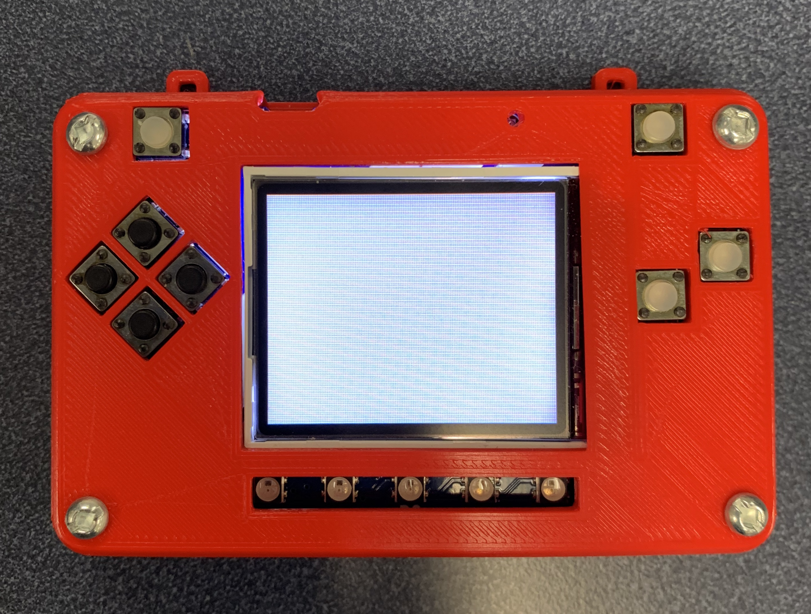

.. _background:

Background
==========

Avoid or Shoot needs a background. This code is puts the first image in the background. The first image is 16 x 16 px image at the top. in this case the first image of image bank is white colour image. Of course when you save the file, save it as :file:`code.py` file:

.. code-block:: python
	:linenos:

	image_bank_1 = stage.Bank.from_bmp16("avoid_or_shoot.bmp")

   	background = stage.Grid(image_bank_1, 10, 8)

As soon as you save the file onto the PyBadge, the screen should flash and you should see something like:

   Background on PyBadge

This code will not work. The code above has a lot to do. Here is a better version that shows the background. You can see that you called the :py:func:`main()` function. This is common in python code but usually not visible in CircuitPython. I am including it because by breaking the code into different functions to match different scenes, eventually will be really helpful.

.. code-block:: python
	:linenos:

	#!/usr/bin/env python3

	# Created by : Jay Lee
	# Created on : Jan 2020
	# This program display background of pybadge
	
	import ugame
	import stage

	  
	def main():
	    # this function display background of pybadge
	    image_bank_1 = stage.Bank.from_bmp16("avoid_or_shoot.bmp")

   	    background = stage.Grid(image_bank_1, 10, 8)

	    # create a stage for the background to show up on
	    #   and set the frame rate to 60fps
	    game = stage.Stage(ugame.display, 60)
	    # set the layers, items show up in order
	    game.layers = [background]
	    # render the background and inital location of sprite list
	    # most likely you will only render background once per scene
	    game.render_block()

	    # repeat forever, game loop
	    while true:
	    	pass

	if __name__ == "__main__":
	    main()
    

This is the basis of the background function.
