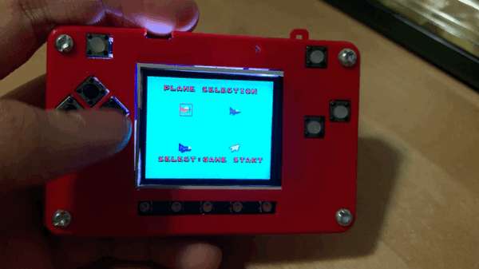

.. _selection:

Plane Selection
==========

sprites can be placed in front of the background. xxx

.. code-block:: python
        :linenos:

        While True:
            keys = ugame.buttons.get_pressed()
            
            if keys & ugame.K_RIGHT:
                plane.move(plane.x + 1, plane.y)
                pass
            if keys & ugame.K_LEFT:
                plane.move(plane.x - 1, plane.y)
                pass
            if keys & ugame.K_UP:
                plane.move(plane.x, plane.y - 1)
                pass
            if keys & ugame.K_DOWN:
                plane.move(plane.x, plane.y + 1)
                pass
            
            game.render_sprites(sprites)
            game.tick()

As soon as you save the file onto the PyBadge, the screen should flash and you should see something like:

   Plane Selection

This code will not work. The code above has a lot to do. Here is a better version that shows the background. You can see that you called the :py:func:`main()` function. This is common in python code but usually not visible in CircuitPython. I am including it because by breaking the code into different functions to match different scenes, eventually will be really helpful.

Now, you can move a plane in front of your background on your PyBadge.
    

