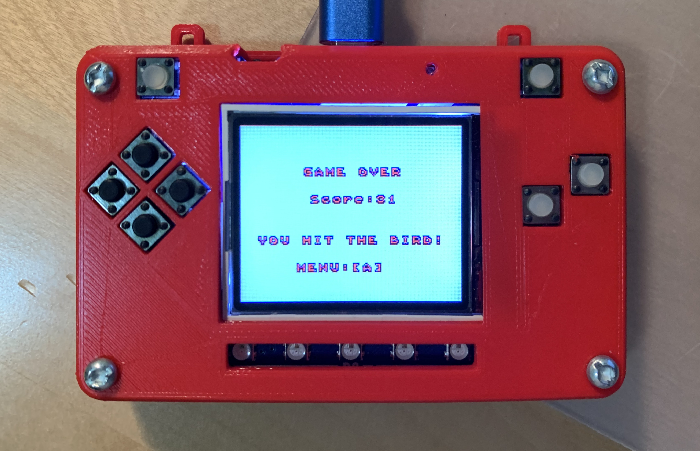

.. _game_over_scene:

Game Over Scene
===============

When the game is over, the screen switches to here. This scene shows some information.

.. code-block:: python
        :linenos:
        
        def game_over_scene(final_score, cause):

You get the score of game and cause from the game.

.. code-block:: python
        :linenos:
        
        text2 = stage.Text(width=29, height=14, font=None,
                       palette=constants.MT_GAME_STUDIO_PALETTE, buffer=None)
        text2.move(50, 50)
        text2.text("Score:{0}".format(final_score))
        text.append(text2)

        if cause == 0:
            text3 = stage.Text(width=29, height=14, font=None,
                               palette=constants.MT_GAME_STUDIO_PALETTE,
                               buffer=None)
            text3.move(12, 80)
            text3.text("YOU HIT THE BIRD!")
            text.append(text3)
        else:
            text3 = stage.Text(width=29, height=14, font=None,
                               palette=constants.MT_GAME_STUDIO_PALETTE,
                               buffer=None)
            text3.move(10, 80)
            text3.text("YOU HIT THE PLANE!")
            text.append(text3)

The score put on the screen. And use if statement to indicate the cause. `game_over.py <https://github.com/jaeyoon-lee2/ICS3U-2019-Group19/blob/master/docs/menu/game_over.py>`_ This is the full codes of game over scene.

As soon as you save the file onto the PyBadge, the screen should flash and you should see something like:

    Game Over Scene
