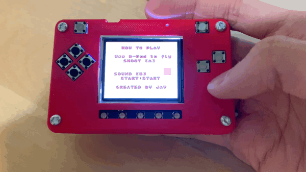

.. _help_scene:

Help Scene
============

Add some information about this game. Add text with this `help_text.py <./help_text.py>`_. Then create a box to control the sound.

.. code-block:: python
        :linenos:
        
        b_button = constants.button_state["button_up"]
        start_button = constants.button_state["button_up"]
        select_button = constants.button_state["button_up"]
        
        box = []

        check_box = stage.Sprite(image_bank_3, 4, 130, 60)
        box.append(check_box)

        border = []

        box_border = stage.Sprite(image_bank_3, 13, 130, 60)
        border.append(box_border)

The above code will display a sound control box on the screen.

.. code-block:: python
        :linenos:
        
        while True:
            keys = ugame.buttons.get_pressed()

            if keys & ugame.K_O != 0:
                if b_button == constants.button_state["button_up"]:
                    b_button = constants.button_state["button_just_pressed"]
                elif b_button == constants.button_state["button_just_pressed"]:
                    b_button = constants.button_state["button_still_pressed"]
            else:
                if b_button == constants.button_state["button_still_pressed"]:
                    b_button = constants.button_state["button_released"]
                else:
                    b_button = constants.button_state["button_up"]

            if b_button == constants.button_state["button_just_pressed"]:
                if keys & ugame.K_O != 0:
                    volume += 1
            if volume % 2 == 1:
                check_box.move(constants.OFF_SCREEN_X, constants.OFF_SCREEN_Y)
            else:
                check_box.move(130, 60)

As soon as you save the file onto the PyBadge, the screen should flash and you should see something like:

   Mute Button
You can press B button to mute sound.
