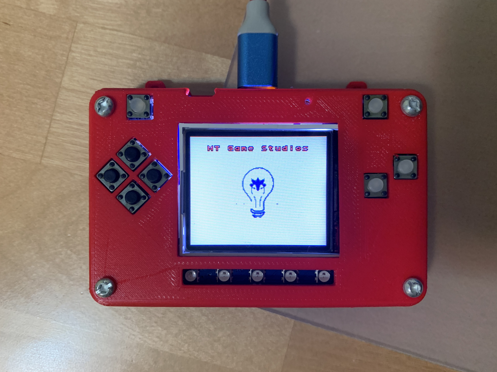

.. _splash_scene:

Splash Scene
============

Avoid or Shoot needs a background. This code is puts the first image in the background. The first image is 16 x 16 px image at the top. 
in this case the first image of image bank is white colour image. Of course when you save the file, save it as :file:`code.py` file:

We use another image bank

  MT Game studio
  
.. code-block:: python
	:linenos:

	  image_bank_2 = stage.Bank.from_bmp16("mt_game_studio.bmp")

    # sets the background to image 0 in the bank
    background = stage.Grid(image_bank_2, 10, 8)
    
    background.tile(2, 2, 0)  # blank white
    background.tile(3, 2, 1)
    background.tile(4, 2, 2)
    background.tile(5, 2, 3)
    background.tile(6, 2, 4)
    background.tile(7, 2, 0)  # blank white

    background.tile(2, 3, 0)  # blank white
    background.tile(3, 3, 5)
    background.tile(4, 3, 6)
    background.tile(5, 3, 7)
    background.tile(6, 3, 8)
    background.tile(7, 3, 0)  # blank white

    background.tile(2, 4, 0)  # blank white
    background.tile(3, 4, 9)
    background.tile(4, 4, 10)
    background.tile(5, 4, 11)
    background.tile(6, 4, 12)
    background.tile(7, 4, 0)  # blank white

    background.tile(2, 5, 0)  # blank white
    background.tile(3, 5, 0)
    background.tile(4, 5, 13)
    background.tile(5, 5, 14)
    background.tile(6, 5, 0)
    background.tile(7, 5, 0)  # blank white

As soon as you save the file onto the PyBadge, the screen should flash and you should see something like:

  MT game studio splash on PyBadge

This code will not work. The code above has a lot to do. Here is a better version that shows the background. You can see that you called the :py:func:`main()` function. This is common in python code but usually not visible in CircuitPython. I am including it because by breaking the code into different functions to match different scenes, eventually will be really helpful.
