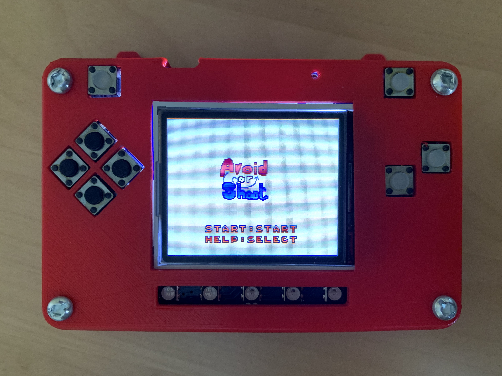

.. _start_scene:

Start Scene
===========

Avoid or Shoot needs a logo. So I make th logo of this game. This image is the same image shown on the left.

We use another image bank. 

.. figure:: https://raw.githubusercontent.com/jaeyoon-lee2/ICS3U-2019-Group19/master/avoid_title.bmp
    :height: 256 px
    :align: center
    :alt: Game Title Image Bank

    Game Title Image Bank
  
.. code-block:: python
	:linenos:

	image_bank_3 = stage.Bank.from_bmp16("avoid_title.bmp")

	# sets the background to image 0 in the bank
	background = stage.Grid(image_bank_3, 10, 8)

	background.tile(2, 2, 0)
        background.tile(3, 2, 1)
        background.tile(4, 2, 2)
        background.tile(5, 2, 3)
        background.tile(6, 2, 0)

        background.tile(2, 3, 0)
        background.tile(3, 3, 4)
        background.tile(4, 3, 5)
        background.tile(5, 3, 6)
        background.tile(6, 3, 0)

        background.tile(2, 4, 0)
        background.tile(3, 4, 7)
        background.tile(4, 4, 8)
        background.tile(5, 4, 9)
        background.tile(6, 4, 0)
	
	text = []

        text1 = stage.Text(width=29, height=14, font=None,
                           palette=constants.MT_GAME_STUDIO_PALETTE, buffer=None)
        text1.move(35, 100)
        text1.text("START:START")
        text.append(text1)
  
        text2 = stage.Text(width=29, height=14, font=None,
                           palette=constants.MT_GAME_STUDIO_PALETTE, buffer=None)
        text2.move(35, 110)
        text2.text("HELP:SELECT")
        text.append(text2)

This codes is used to create a large image by concatenatiing the images in the image bank one by one. It was previously covered in Splash Scene.

As soon as you save the file onto the PyBadge, the screen should flash and you should see something like:

   Game Title on PyBadg

Also we need to go to other scene with buttons.

.. code-block:: python
	:linenos:

        while True:
            keys = ugame.buttons.get_pressed()

            if keys & ugame.K_START != 0:
                selection_scene()
            elif keys & ugame.K_SELECT != 0:
                help_scene()

            game.tick()

That makes to switch scenes to selection and help scene with start and select button.
